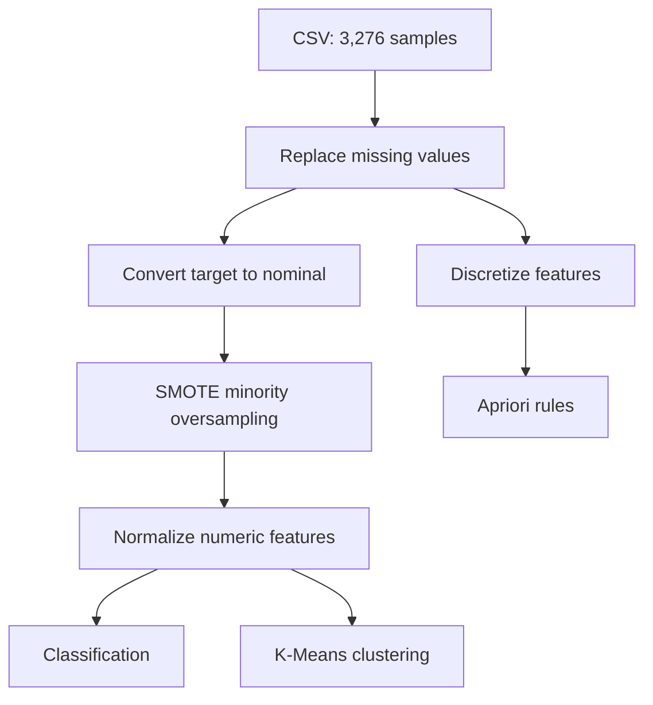

<div align="center">

# Water Potability Prediction

### Water-quality analysis with Java, WEKA, and multiple data-mining techniques

Classify drinking-water samples, discover natural quality profiles, and mine relationships across nine physicochemical measurements.


</div>

## Overview

This project applies a complete data-mining workflow to the [Water Quality and Potability dataset](https://www.kaggle.com/datasets/adityakadiwal/water-potability). It analyzes 3,276 source samples using nine water-quality parameters and a binary potability target.

The Java implementation uses the WEKA API for three complementary tasks:

- **Supervised learning:** Naive Bayes, J48 Decision Tree, Random Forest, and a voting ensemble
- **Unsupervised learning:** K-Means clustering with interactive WEKA visualizations
- **Association analysis:** Apriori, with an optional FP-Growth path in the source

> This is an educational data-mining project, not a substitute for laboratory testing or professional water-safety assessment.

## Results

The latest result captures committed to this repository use the SMOTE-balanced, normalized dataset with **4,554 processed instances** and 10-fold cross-validation.

| Model | Accuracy |
| --- | ---: |
| Naive Bayes | 59.99% |
| Decision Tree (J48) | 63.75% |
| Voting ensemble | 66.56% |
| **Random Forest** | **69.98%** |

The voting ensemble combines Naive Bayes, J48, and Random Forest. Its recorded weighted metrics are **0.664 precision**, **0.666 recall**, **0.657 F1-score**, and **0.726 ROC AUC**.

| Classifier evaluation | End-to-end pipeline output |
| --- | --- |
|  |  |

### Cluster exploration

K-Means separates the processed data into two broad profiles. The stored run produced clusters of 2,748 and 1,806 instances; the visualization below shows their separation across solids and turbidity.


Additional plots for trihalomethanes, organic carbon, sulfate, and a scatter-plot matrix are available in [`Results JPEG/`](Results%20JPEG/).

## Data pipeline



### Input features

| Feature | What it represents |
| --- | --- |
| pH | Acidity or alkalinity |
| Hardness | Dissolved calcium and magnesium salts |
| Solids | Total dissolved solids |
| Chloramines | Disinfectant concentration |
| Sulfate | Sulfate concentration |
| Conductivity | Electrical conductivity |
| Organic carbon | Organic carbon concentration |
| Trihalomethanes | Disinfection by-product concentration |
| Turbidity | Water clarity |
| Potability | Target class: non-potable or potable |

## Project structure

```text
.
├── data/
│   ├── water_potability.csv              # Original dataset
│   ├── processed_water_potability.arff   # SMOTE-balanced and normalized data
│   └── raw_processed_water_potability.arff
├── models/
│   └── water_quality_voting.model        # Serialized WEKA voting classifier
├── Results JPEG/                         # Terminal captures and cluster plots
├── src/main/java/com/aust/waterpotability/
│   ├── Main.java                         # Runs the full workflow
│   ├── Preprocessor.java                 # Cleans and transforms the CSV
│   ├── SupervisedModel.java              # Trains/evaluates the ensemble
│   ├── ClassifierEvaluation.java         # Compares individual classifiers
│   ├── UnsupervisedModel.java            # K-Means and interactive plot
│   ├── AssociationRulesRunner.java       # Apriori / FP-Growth
│   └── PredictModel.java                 # Loads the saved model for inference
└── pom.xml
```

## Running locally

### Prerequisites

- JDK 8 or newer
- Apache Maven
- A desktop environment for the Swing-based K-Means visualization

### Install and compile

```bash
git clone https://github.com/steezy-archv/WaterPotabilityPrediction.git
cd WaterPotabilityPrediction
mvn clean compile
```

### Run the complete workflow

```bash
mvn exec:java -Dexec.mainClass="com.aust.waterpotability.Main"
```

This evaluates the voting classifier, saves it to `models/water_quality_voting.model`, opens the K-Means visualization, and runs Apriori.

### Run individual stages

```bash
# Rebuild the processed ARFF dataset
mvn exec:java -Dexec.mainClass="com.aust.waterpotability.Preprocessor"

# Compare Naive Bayes, J48, and Random Forest
mvn exec:java -Dexec.mainClass="com.aust.waterpotability.ClassifierEvaluation"

# Train and evaluate the voting ensemble
mvn exec:java -Dexec.mainClass="com.aust.waterpotability.SupervisedModel"

# Run K-Means and open its visualizer
mvn exec:java -Dexec.mainClass="com.aust.waterpotability.UnsupervisedModel"

# Mine association rules
mvn exec:java -Dexec.mainClass="com.aust.waterpotability.AssociationRulesRunner"
```

`PredictModel` expects a compatible file at `data/new_water_samples.arff`. Create that file with the same schema and preprocessing as the training data before running inference.

## Report and reproducibility note

The accompanying course report records an earlier experiment on the original 3,276 instances, where Random Forest achieved 67.28% accuracy. The source code and screenshots currently in this repository reflect the later SMOTE-enhanced pipeline and therefore produce different figures. Both sets of results are retained transparently instead of being presented as the same experiment.

## Team

Created as a Data Mining course project by **Mainul Hasan Khan**, **Mayesha Kader**, and **Tasmiah Binte Iqbal** at Ahsanullah University of Science & Technology.

## Limitations and next steps

- Performance remains moderate and should be validated on independent geographic datasets.
- SMOTE is applied before cross-validation in the current implementation; moving resampling inside each training fold would reduce leakage risk.
- Hyperparameter tuning and cost-sensitive evaluation could better account for the higher public-health cost of false-safe predictions.
- `PredictModel` currently expects a prepared ARFF file rather than accepting interactive input.

